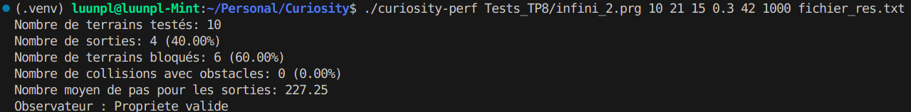

# Introduction
**Curiosity** est un projet inspiré par la mission du rover Curiosity visant à rechercher de l’eau sur Mars. L’objectif du projet INF304 est d’exécuter le fichier `curiosity-perf` avec les paramètres décrits dans la section **Usage**, afin de générer un terrain aléatoire avec une densité d’objets variable, dans le but de trouver un chemin permettant de s’en échapper.

---

## Demande
### Installer clang
Pour installer `clang` sous Linux, utilisez la commande suivante :
```bash
sudo apt install clang
```

---

## Compilation de Curiosity
Pour compiler le programme, utilisez la commande suivante :
```bash
make
```

---

## Usage
Pour exécuter le programme, utilisez la commande suivante :
```bash
./curiosity-perf <fichier_programme> <N> <L> <H> <d> <graine> <nb_step_max> <fichier_res>
```

### Description des paramètres :
1. **`<fichier_programme>`** :  
   Chemin vers le fichier contenant le programme à exécuter. Ce fichier doit contenir les instructions pour le rover.

2. **`<N>`** :  
   Nombre de terrains à générer. Chaque terrain est une grille aléatoire.

3. **`<L>`** :  
   Largeur de chaque terrain (nombre de colonnes).

4. **`<H>`** :  
   Hauteur de chaque terrain (nombre de lignes).

5. **`<d>`** :  
   Densité des obstacles sur le terrain. C'est une valeur décimale entre `0` et `1` qui représente le pourcentage de cases occupées par des obstacles. Par exemple :  
   - `0.4` signifie que 40 % des cases seront des obstacles.

6. **`<graine>`** :  
   Graine utilisée pour initialiser le générateur de nombres aléatoires. Cela permet de reproduire les mêmes terrains aléatoires si la même graine est utilisée.

7. **`<nb_step_max>`** :  
   Nombre maximum d'étapes que le rover peut effectuer avant d'arrêter l'exécution.

8. **`<fichier_res>`** :  
   Chemin vers le fichier où les résultats seront enregistrés. Ce fichier contiendra les statistiques et les informations sur les terrains générés.

---

## Description des Tests
Les tests sont créés selon l'énoncé de chaque TP :
- **Tests_TP7** : Vérifie la position finale du robot après exécution.
- **Tests_TP8** : Contient des programmes infinis pour trouver la sortie.
- **Tests_TP9** : Vérifie les programmes pour l'observateur.

---

## Description de l'algorithme pour décider des obstacles
L'algorithme utilisé dans le fichier `generation_terrains.c` pour décider si une case est un obstacle ou non est décrit comme suit :
1. Générer une valeur aléatoire entre 0 et 100.
2. Si cette valeur est inférieure à `dObst * 100` (où `dObst` est la densité des obstacles) :  
   - Générer une autre valeur aléatoire entre 0 et 1.  
   - Si cette valeur est 0, la case est un **rocher**.  
   - Sinon, la case est de l'**eau**.
3. Si la première valeur aléatoire est supérieure ou égale à `dObst * 100`, la case est **libre**.

---

## Exemple d'exécution
```bash
./curiosity-perf Tests_TP8/infini_2.prg 10 20 15 0.3 42 1000 fichier_res.txt
```
- **`Tests_TP8/infini_2.prg`** : Contient les instructions pour le rover.
- **`10`** : Génère 10 terrains.
- **`20`** : Chaque terrain a une largeur de 20 cases.
- **`15`** : Chaque terrain a une hauteur de 15 cases.
- **`0.3`** : 30 % des cases sont des obstacles.
- **`42`** : Graine pour le générateur aléatoire.
- **`1000`** : Le rover peut effectuer jusqu'à 1000 étapes.
- **`fichier_res.txt`** : Les résultats seront enregistrés dans ce fichier.

---

## Résultat


---

## Notes
- Assurez-vous que le fichier `Tests_TP8/infini_2.prg` est correctement formaté avant de l'exécuter.
- La densité des obstacles (`<d>`) doit être comprise entre `0` et `1`. Une valeur trop élevée peut rendre les terrains impraticables.
- Le fichier de résultats (`<fichier_res>`) sera écrasé s'il existe déjà.

